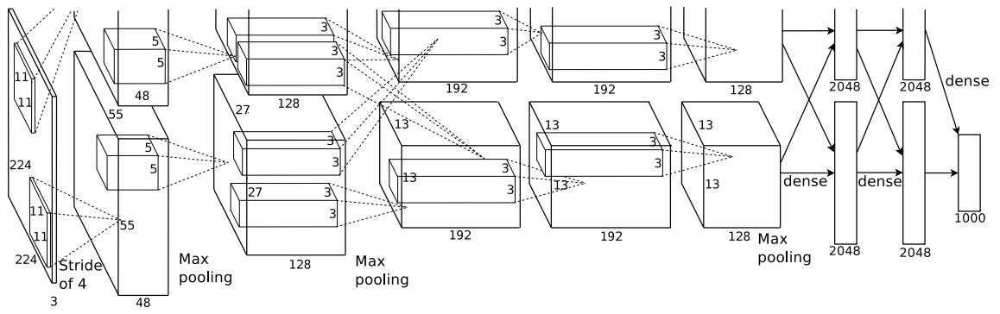

# AlexNet, ImageNet Classification with Deep Convolutional Neural Networks
 논문 링크
<https://proceedings.neurips.cc/paper_files/paper/2012/file/c399862d3b9d6b76c8436e924a68c45b-Paper.pdf>

# 논문 소개

ImageNet Classification with Deep Convolutional Neural Networks
2012년 ImageNet Classification 대회에서 83.7%의 TOP-5 정확도로 우승을 차지한 AlexNet모델에 대한 논문이다.

# 구조

## ReLU Nonlinearity

##
